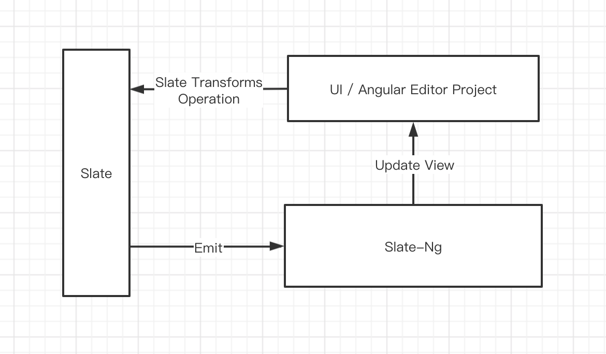
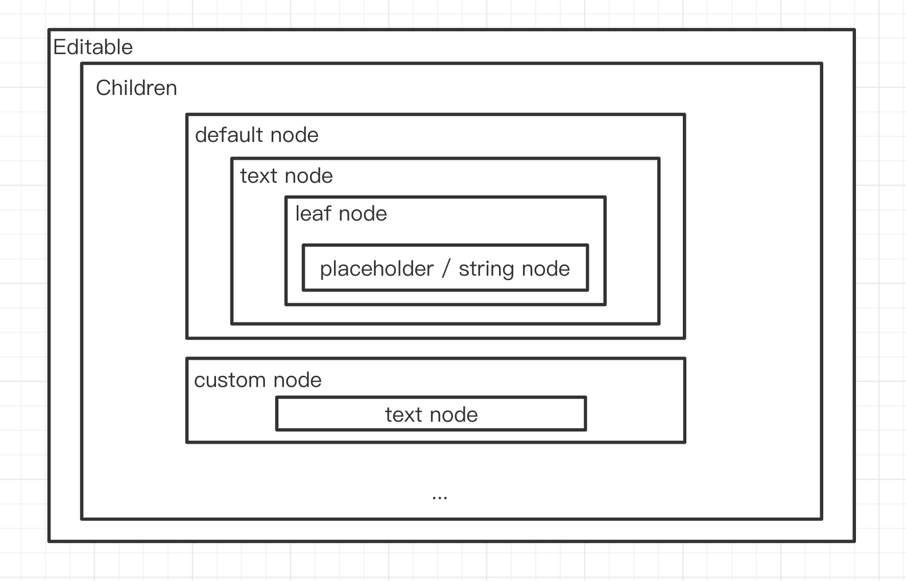

# Implementation plan (under revision)

1. Interactive process

   

2. Analysis

   The general structure of slate-ng:

   

   From the figure, we can see the general structure of slate-ng. In slate-ng, each Slate Node is regarded as a Component, assembled into `Component Portal` according to certain requirements, and mounted to the corresponding position for rendering and display. 
   The core point here lies in the logic under `Children`. Here are a few points involved:

    - How to get the components corresponding to each node?

    - How to deal with the component and its children corresponding to each node?

    - How to pass the context to each dynamic component?

    - How to optimize the treatment plan?

   Then let's go over it bit by bit：

    1. How to get the components corresponding to each node ？

       The approach here is different from react, react in by `renderElement`,` renderLeaf`, `renderPlaceholder` are transmitted to the inner components for processing, 
       but we cannot enjoy the benefits of this approach in `slate-ng`. So I simplified it to the following transmission and storage (there will be some differences 
       in the implementation of slate-ng as follows, see [registry-ns-element](https://github.com/chongqiangchen/slate-ng/blob/master/projects/slate-ng-view/src/services/registry-ns-element.service.ts):
       ```
       // default store value
       const defaultStore = {
               default: DefalutElementComponent,
               text: TextComponent,
               leaf: LeafComponent,
               placeholder: PlaceholderComponent
       }
       
       // create a new Component corresponding to Node
       @Component({...})
       export class ComponentA {
               static type = 'A' // node component flag
       }
           
       // use service to register
       this.registryService.add([ComponentA, ComponentB])
       
       // the final store
       const store = {
               ...defaultStore,
               A: ComponentA
       }
       
       // Obtain directly from the object according to the type
       ```

    2. How to deal with the component and its children corresponding to each node?

       Here I refer to some processing methods of `react` `use-children` and create a children component used to recursively traverse the editor data to assemble a complete portal. 
       The code is as follows (simplified code)：

       ```
       
        resolvePortals(pNode: Ancestor): Array<ComponentPortal<any>> {
           const children = [];
           const editor = this.editorService.editor;
           // ...
           for (let i = 0; i < pNode.children.length; i++) {
             const cNode = pNode.children[i] as Ancestor | Descendant;
             // ...
             let childPortals = [];
             let portal = null;
             if ((cNode as Ancestor).children) {
               childPortals = this.resolvePortals(cNode as Ancestor); // Important!
             }
             // Store childProtals through Injector
             const providers = [
               {provide: CHILD_PORTALS_TOKEN, useValue: childPortals } 
               // ...
             ];
             // ...
             portal = new ComponentPortal(this.regsitorService.get(type), injector.create(providers, this.injector));
             children.push(portal);
           }
           return children;
         }
         
        // portals
        [
           ComponentPortalA,
           ComponentPortalB,
           ...
        ]
       ```

       You may find it strange, where is the content of `child`? This involves the knowledge of `ComponentPortal Injector`, which is also mentioned in the previous annotations. 
       That is to say, each `ComponentPortal` actually carries its `childPortals`, you The output of `protals` can be understood as such a structure (the real structure is definitely not the case, but you can roughly understand that we have such a general structure):

       ```
       [
            ComponentPortalA: {
                 injector: {
                    child_token: [
                       ComponentPortalA0,
                       ComponentPortalA1
                    ]            
                 }
            },
            ComponentPortalB
       ]
       ```

       Finally, we put it in html for processing and rendering:

       ```
       <ng-container *ngFor="let portal of showPortals;">
         <ng-template [cdkPortalOutlet]="portal"></ng-template>
       </ng-container>
       ```

    3. How to pass the context to each dynamic component ？

       In fact, we also involved in the second point, that is, `Component` allows passing `injector`, we pass the required content through `Injector.create(providers, this.parentInjector)`

    4. How to optimize the treatment plan ？

       There is a problem here, because we will create a new ComponentPortal every time, but be careful, suppose we have a sequence, the structure is as follows:

       ```
       {
            type: 'list',
            children: [
              {
                 type: 'li',
                 ...
              }
            ]
       }
       ```

       If you perform a sequence addition operation, it will add a `li` to `children`, and a new `ComponentPortal` will be recreated every time in the previous processing, which means that we need to complete a small change Re-rendering, this is a very high performance problem, 
       so we need to do caching, we only need to make the changed `node` recreate a new `portal`, and the others continue to use the previous ones, [code address](https://github.com/chongqiangchen/slate-ng/blob/015c77ca710ff52dbabcb71374be87c2e394cc13/projects/slate-ng-view/src/components/children/children.component.ts#L175)

